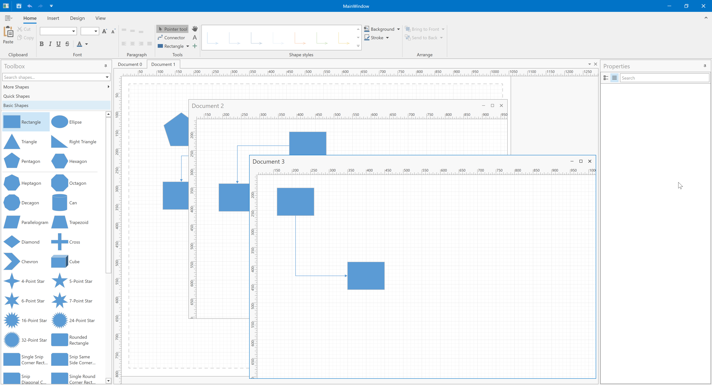

<!-- default badges list -->

<!-- default badges end -->

# DiagramControl for WPF - Display Multiple Diagrams as MDI Documents

This example demonstrates how to use the [Dock and Layout Manager](https://docs.devexpress.com/WPF/6191/controls-and-libraries/layout-management/dock-windows) to create multiple diagram documents. The **Tools** ribbon page group contains the **Create document** button that creates a new diagram document.

The following list contains the main ideas of this example:

1. Use the [Document Management System](https://docs.devexpress.com/WPF/18234/mvvm-framework/services/predefined-set/document-services/document-management-system) to create multiple document panels that display diagrams.
2. Use data bindings to connect these panels to diagram elements ([toolbox](https://docs.devexpress.com/WPF/116504/controls-and-libraries/diagram-control/diagram-designer-control/shapes-panel), [properties panel](https://docs.devexpress.com/WPF/116506/controls-and-libraries/diagram-control/diagram-designer-control/properties-panel), and [ribbon](https://docs.devexpress.com/WPF/116507/controls-and-libraries/diagram-control/diagram-designer-control/ribbon)).

## Files to Review

* [MainWindow.xaml](CS/MainWindow.xaml)
* [ViewModel.cs](CS/ViewModel.cs)

## Documentation

* [Dock and Layout Manager](https://docs.devexpress.com/WPF/6191/controls-and-libraries/layout-management/dock-windows)
* [Document Management System](https://docs.devexpress.com/WPF/18234/mvvm-framework/services/predefined-set/document-services/document-management-system)
* [DXBinding](https://docs.devexpress.com/WPF/115770/mvvm-framework/dxbinding)

## More Examples

* [WPF Diagram - Use the DiagramDataBindingBehavior to Generate a Diagram from a Collection](https://github.com/DevExpress-Examples/wpf-diagram-use-diagramdatabindingbehavior-to-generate-diagram-from-collection)
<!-- feedback -->
## Does this example address your development requirements/objectives?

 

(you will be redirected to DevExpress.com to submit your response)
<!-- feedback end -->
